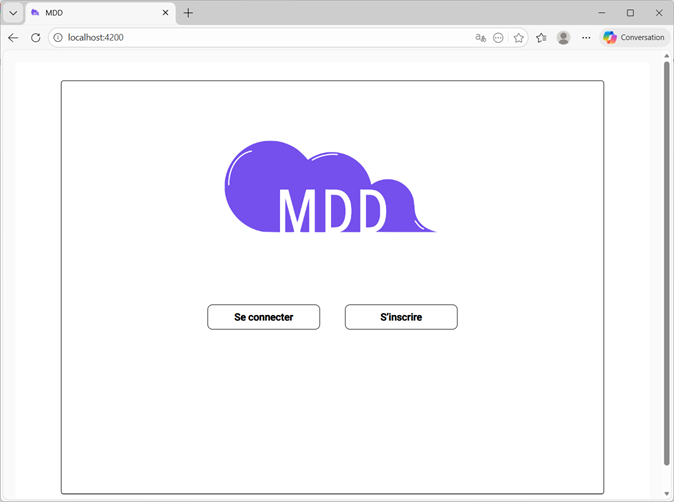
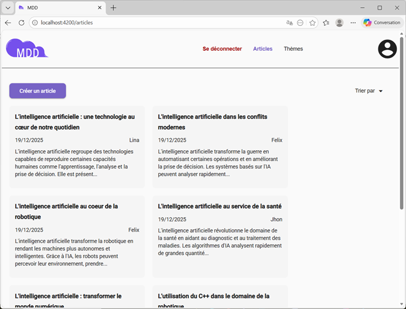
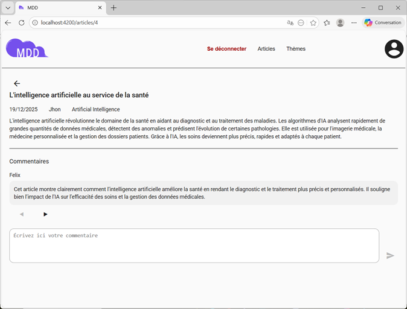
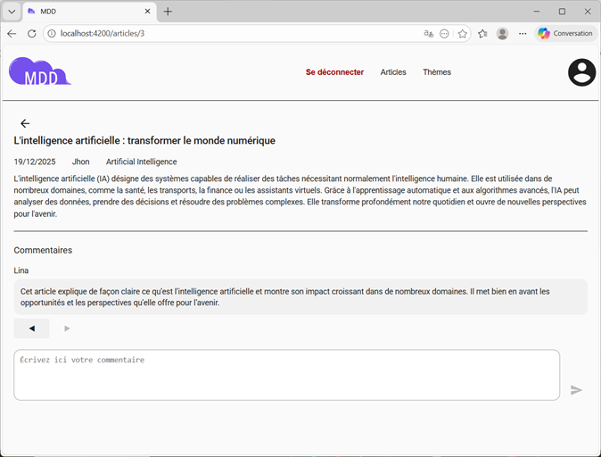
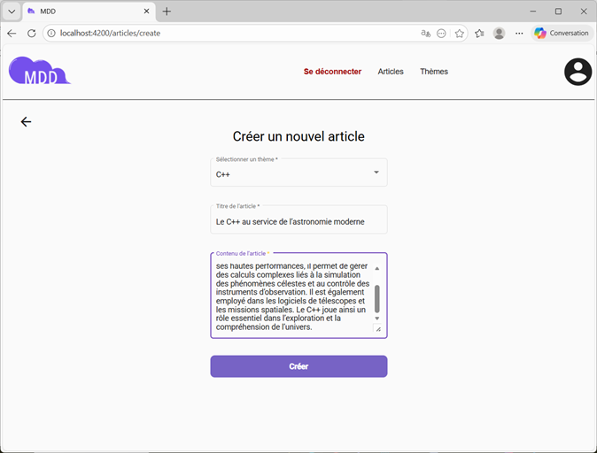
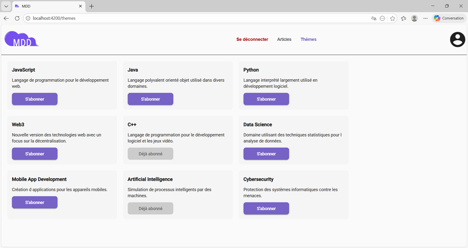
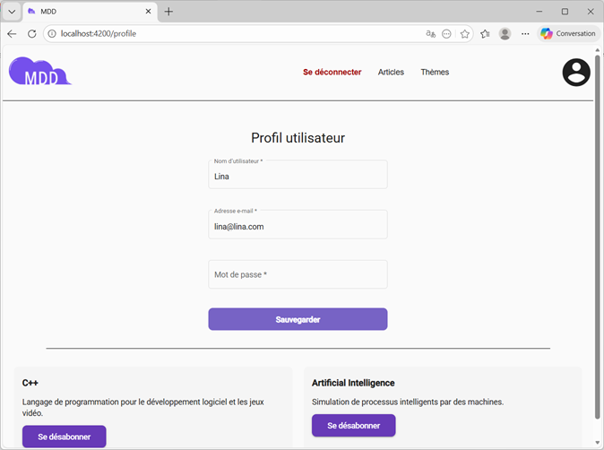
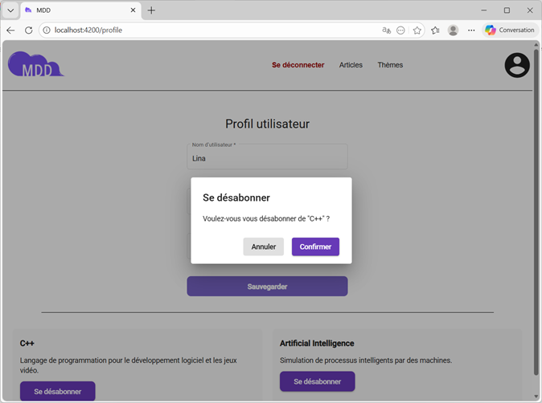

# 📰 MDD – Frontend Angular

 

Ce projet est le **frontend Angular** de l’application full stack  **MDD (Monde de Dév)**.  
Il permet aux utilisateurs de consulter des articles, commenter, s’abonner à des thèmes, gérer leur profil et publier du contenu.

Le frontend communique avec une API REST sécurisée via JWT.

---

## 🚀 Technologies utilisées

- **Angular** 14+
- **Angular Material** (UI & accessibilité)
- **RxJS**
- **TypeScript**
- **SCSS**
- **JWT Authentication**
- **REST API**

---

## 📦 Fonctionnalités principales

### 🔐 Authentification
- Inscription
- Connexion
- Gestion du token JWT
- Routes protégées via `AuthGuard`
- Persistance de session via `localStorage`

| Connexion | Inscription |
|----------|-------------|
|  |  |

### 📰 Articles
- Affichage du feed d’articles
- Tri par date
- Détail d’un article
- Ajout de commentaires
- Rafraîchissement automatique des commentaires
- Notifications toast (succès / erreur)

| Feed des articles | Détail d’un article |
|------------------|---------------------|
|  |  |

| Ajout de commentaire | Navigation entre commentaires |
|---------------------|-------------------------------|
|  |  |

### ✍️ Création d’article
- Création d’un nouvel article
- Sélection des thèmes auxquels l’utilisateur est abonné
- Validation des formulaires
- Redirection vers l’article créé

| Formulaire de création |
|------------------------|
|  |

---
### 🧩 Thèmes (Subjects)
- Liste des thèmes disponibles
- Indication des thèmes déjà abonnés
- Abonnement à un thème
- Désactivation automatique du bouton si déjà abonné

| Liste des thèmes disponibles |
|------------------------|
|  |

### 👤 Profil utilisateur
- Chargement des informations utilisateur
- Mise à jour email / username / mot de passe
- Rafraîchissement du token après mise à jour
- Liste des abonnements
- Désabonnement avec confirmation
- Notification de succès après mise à jour

| Profil | Désabonnement |
|--------|---------------|
|  |  |

---

## 🏗️ Architecture du projet
```
src/
├── app/
│   ├── core/
│   │   ├── services/        # Services API (auth, articles, subjects), gestion du token, notifications (toast)
│   │   ├── guards/          # AuthGuard : protège les routes sécurisées
│   │   ├── header/          # Header principal (navigation)
│   │   ├── interceptors/    # Intercepteurs HTTP (ajout automatique du token JWT)
│   │   └── models/          # Interfaces TypeScript partagées (User, Article, Subject, Comment, API responses)
│   ├── features/
│   │   ├── auth/            # Authentification : Login, Register, Profile (gestion du compte utilisateur, désabonnement)
│   │   ├── articles/        # Articles : feed, détail d’un article, création, commentaires
│   │   └── subjects/        # Sujets / thèmes : liste, abonnement
│   ├── pages/
│   │   ├── home/            # Page d’accueil publique de l’application (présentation, accès login/register)
│   ├── shared/
│   │   ├── components/      # Composants UI réutilisables (dialogs de confirmation) 
│   └── app-routing.module.ts # Définition des routes et protections via AuthGuard

```

---

## 🔌 Communication avec l’API

### Authentification
- `POST /api/auth/login`
- `POST /api/auth/register`
- `GET /api/auth/me`
- `PUT /api/auth/me`

### Articles
- `GET /api/articles`
- `GET /api/articles/{id}`
- `POST /api/articles`
- `POST /api/articles/{id}/comments`

### Thèmes (Subjects)
- `GET /api/subjects`
- `GET /api/subjects?subscribed=true`
- `GET /api/subjects?subscribed=false`
- `POST /api/subjects/{id}/subscribe`
- `POST /api/subjects/{id}/unsubscribe`

---

## ⚙️ Installation & lancement

### 1️⃣ Prérequis
- Node.js ≥ 16
- Angular CLI

### 2️⃣ Installation
```bash
npm install

